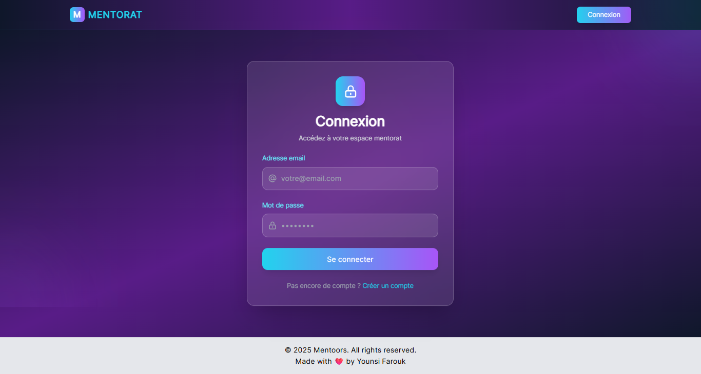
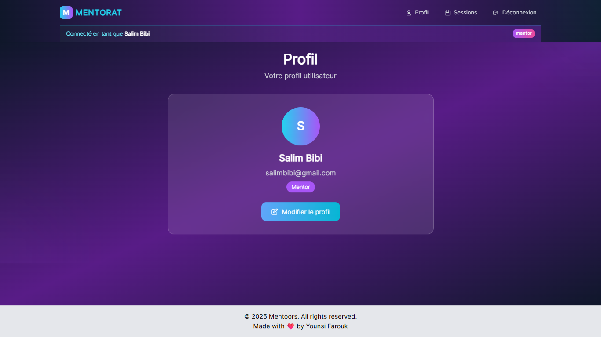
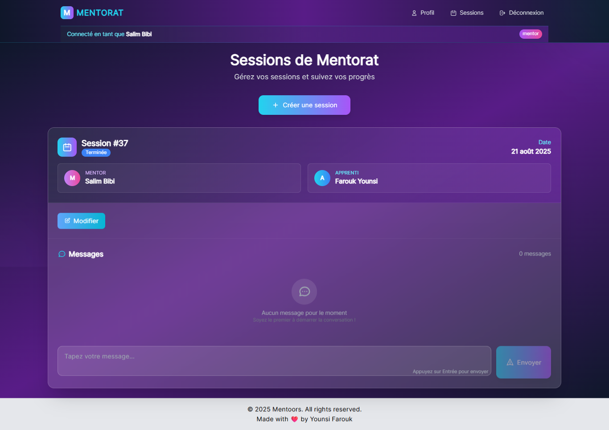
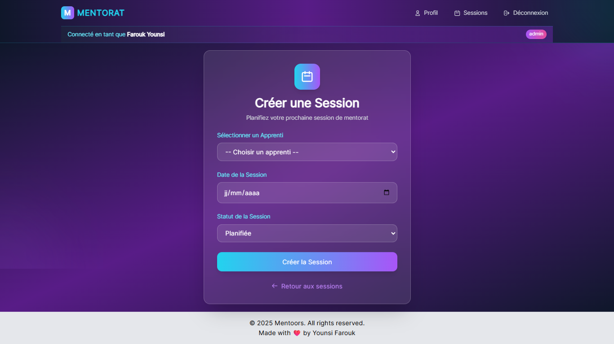

# 📚 Plateforme de Mentorat

## Description

La plateforme de mentorat **Mentoors** est une application full-stack permettant aux mentors et aux mentorés de se connecter, d'organiser des sessions de mentorat et d'échanger des messages. Elle est composée d'une interface utilisateur développée en React (Interface_Mentorat) et d'une API backend en Node.js avec Express (Platforme_Mentorat).

## 📁 Structure du Projet

```
pharouqy-mentoors/
├── Interface_Mentorat/    # Frontend (React + Vite)
│   ├── public/            # Fichiers publics
│   ├── src/               # Code source React
│   │   ├── actions/       # Actions Redux
│   │   ├── components/    # Composants réutilisables
│   │   ├── pages/         # Pages principales
│   │   ├── reducers/      # Réducteurs Redux
│   │   └── routes/        # Gestion des routes
│   ├── package.json       # Dépendances et scripts
│   ├── vite.config.js     # Configuration de Vite
│   ├── tailwind.config.js # Configuration de Tailwind CSS
│   ├── .env               # Variables d'environnement
│   ├── .gitignore         # Fichiers ignorés par Git
│   └── README.md          # Documentation du frontend
│
└── Platforme_Mentorat/    # Backend (Node.js + Express + Sequelize)
    ├── config/            # Configuration de la base de données
    ├── controllers/       # Logique métier
    ├── middlewares/       # Middleware d'authentification
    ├── migrations/        # Migrations Sequelize
    ├── models/            # Modèles Sequelize
    ├── routes/            # Routes API
    ├── package.json       # Dépendances et scripts
    ├── .gitignore         # Fichiers ignorés par Git
    └── README.md          # Documentation du backend
```

## 🚀 Fonctionnalités

✅ Inscription et connexion des utilisateurs (mentors & mentorés)  
✅ Création et gestion des sessions de mentorat  
✅ Messagerie entre mentor et mentoré  
✅ Protection des routes avec authentification JWT  
✅ Stockage des informations en base de données SQL avec Sequelize  
✅ Interface utilisateur moderne avec React et Tailwind CSS  

## 🛠️ Installation & Configuration

### 1️⃣ Cloner le dépôt
```bash
git clone https://github.com/votre-repo/pharouqy-mentoors.git
cd pharouqy-mentoors
```

### 2️⃣ Installation des dépendances
#### Frontend :
```bash
cd Interface_Mentorat
npm install
```
#### Backend :
```bash
cd Platforme_Mentorat
npm install
```

### 3️⃣ Installer et configurer MAMP (MySQL)

Pour utiliser MySQL en local, nous recommandons **MAMP**:

1. Téléchargez et installez MAMP:
   - Windows/macOS: `https://www.mamp.info/en/downloads/`
2. Lancez MAMP et démarrez les serveurs.
3. Par défaut, MySQL écoute sur `127.0.0.1:3306`.
4. Identifiants par défaut (modifiable dans MAMP):
   - Utilisateur: `root`
   - Mot de passe: `root` (sur macOS) ou vide `""` (souvent sur Windows). Vérifiez les préférences MAMP.

Vous pouvez aussi gérer la base via phpMyAdmin depuis MAMP, ou bien utiliser Sequelize CLI (recommandé ci‑dessous).

### 4️⃣ Configuration des fichiers `.env`
Créer un fichier `.env` dans `Platforme_Mentorat/` avec :
```
DB_NAME=mentors
DB_USER=root
DB_PASSWORD=root
DB_HOST=localhost
DB_DIALECT=mysql
DB_PORT=3306
PORT=4000
JWT_SECRET=secret_key
```
Créer un fichier `.env` dans `Interface_Mentorat/` si nécessaire.
```
VITE_API_URL=url_of_API
```

### 5️⃣ Création de la base de données avec Sequelize CLI

Assurez‑vous d'être dans le dossier `Platforme_Mentorat/` et que `sequelize-cli` est installé (il l'est déjà dans les dépendances du projet).

1. Créer la base MySQL (si elle n'existe pas):
```bash
npx sequelize-cli db:create
```

2. Lancer les migrations:
```bash
npm run db:migrate
```

3. (Optionnel) Revenir en arrière ou réinitialiser:
```bash
npm run db:migrate:undo
npm run db:migrate:reset
```

Si `db:create` échoue, vérifiez les identifiants MySQL MAMP (utilisateur/mot de passe) et le port dans `.env` et/ou `Platforme_Mentorat/config/config.json`.

### 6️⃣ Exécution de l'application
#### Démarrer le backend :
```bash
cd Platforme_Mentorat
npm run dev
```

#### Démarrer le frontend :
```bash
cd Interface_Mentorat
npm run dev
```

L'application sera accessible à l'adresse : `http://localhost:5173`

## 🛠 Technologies Utilisées
- **Frontend** : React, Vite, Tailwind CSS
- **Backend** : Node.js, Express, Sequelize, JWT
- **Base de données** : PostgreSQL / MySQL

## 📌 Améliorations futures
- Ajout d'un tableau de bord analytique
- Notifications en temps réel avec WebSockets
- Implémentation d'un calendrier interactif

## 📄 Licence
Ce projet est sous licence **MIT**.

---

👨‍💻 Développé avec ❤️ par **Younsi Farouk** et l'équipe **Mentoors**


## 📷 Captures d'écran

### Accueil


### Authentification
- 
- 

### Profil
- 
- .png)

### Sessions
- 
- .png)
- 
